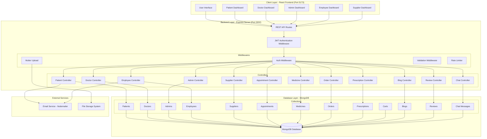
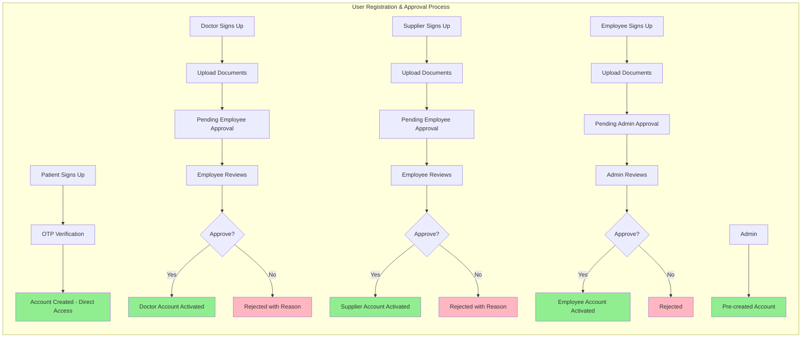
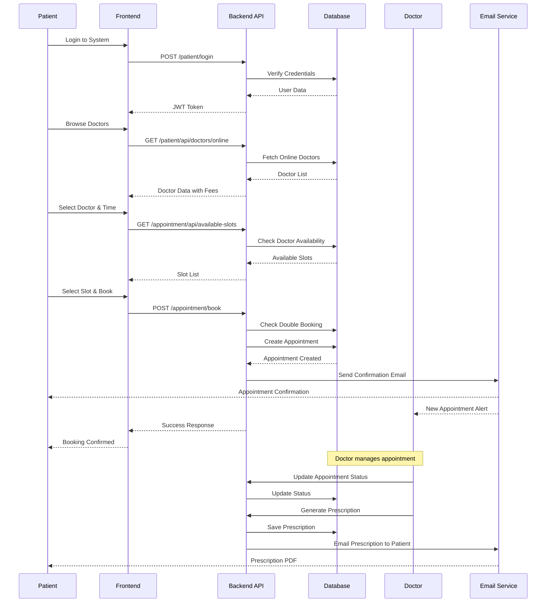
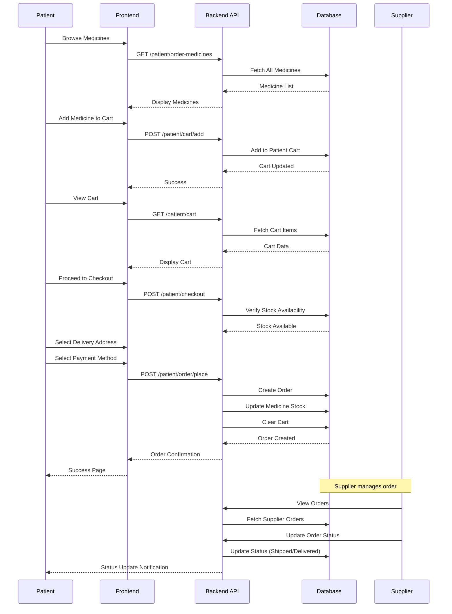
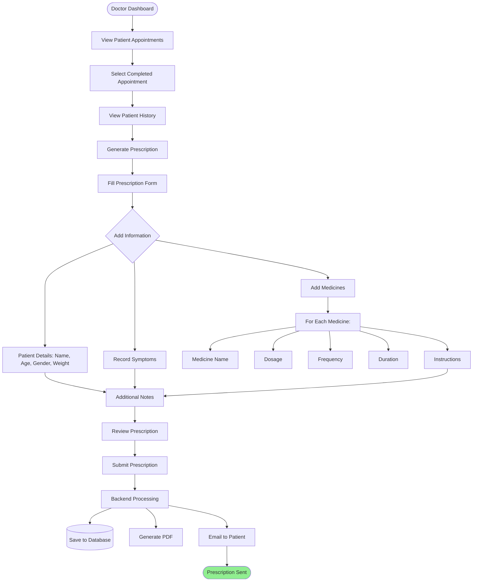
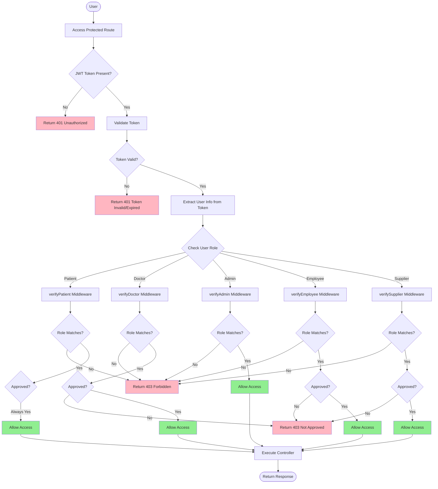
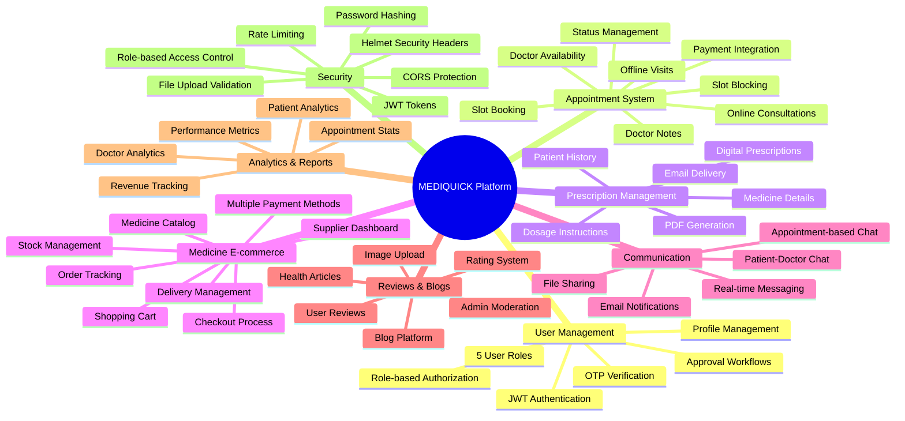
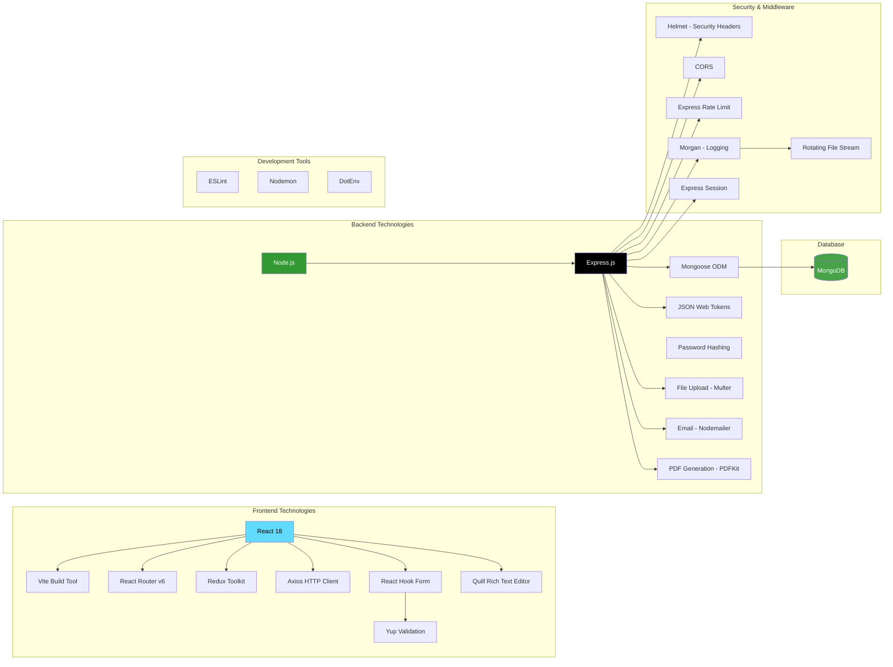

# MEDIQUICK - Complete Project Architecture & Wireframe

## System Overview

**MEDIQUICK** is a comprehensive telemedicine platform with:
- **Frontend**: React + Vite (Port 5173)
- **Backend**: Node.js + Express (Port 3002)
- **Database**: MongoDB
- **Authentication**: JWT-based
- **5 User Roles**: Patient, Doctor, Admin, Employee, Supplier

---

## 1. SYSTEM ARCHITECTURE DIAGRAM



---

## 2. DATABASE SCHEMA & RELATIONSHIPS

```mermaid
erDiagram
    PATIENT ||--o{ APPOINTMENT : books
    PATIENT ||--o{ ORDER : places
    PATIENT ||--o| CART : has
    PATIENT ||--o{ REVIEW : writes
    PATIENT ||--o{ CHAT : sends
    
    DOCTOR ||--o{ APPOINTMENT : manages
    DOCTOR ||--o{ PRESCRIPTION : creates
    DOCTOR ||--o{ REVIEW : writes
    DOCTOR ||--o{ CHAT : sends
    
    APPOINTMENT ||--o| PRESCRIPTION : generates
    APPOINTMENT ||--o{ CHAT : contains
    
    SUPPLIER ||--o{ MEDICINE : supplies
    
    MEDICINE ||--o{ ORDER : ordered_in
    MEDICINE ||--o{ CART_ITEM : added_to
    
    CART ||--o{ CART_ITEM : contains
    
    EMPLOYEE ||--o{ DOCTOR : approves
    EMPLOYEE ||--o{ SUPPLIER : approves
    
    ADMIN ||--o{ EMPLOYEE : approves
    ADMIN ||--o{ REVIEW : monitors
    
    PATIENT {
        ObjectId _id PK
        String name
        String email UK
        String mobile
        String address
        String password
        Date dateOfBirth
        String gender
        Array_addresses addresses
        String profilePhoto
        Date createdAt
        Date updatedAt
    }
    
    DOCTOR {
        ObjectId _id PK
        String name
        String email UK
        String mobile
        String address
        String registrationNumber UK
        String specialization
        String college
        String yearOfPassing
        String location
        String onlineStatus
        Number consultationFee
        Date dateOfBirth
        String gender
        String password
        Boolean isApproved
        String documentPath
        String profilePhoto
        Date lastLogin
        Date createdAt
        Date updatedAt
    }
    
    APPOINTMENT {
        ObjectId _id PK
        ObjectId patientId FK
        ObjectId doctorId FK
        Date date
        String time
        String status
        String type
        Number consultationFee
        String modeOfPayment
        String notes
        Boolean isBlockedSlot
        Object_doctorNotes doctorNotes
        Date createdAt
        Date updatedAt
    }
    
    PRESCRIPTION {
        ObjectId _id PK
        String patientName
        String patientEmail
        String doctorEmail
        Number age
        String gender
        Number weight
        Date appointmentDate
        String appointmentTime
        String symptoms
        Array_medicines medicines
        String additionalNotes
        ObjectId doctorId FK
        ObjectId patientId FK
        ObjectId appointmentId FK
        Date createdAt
        Date updatedAt
    }
    
    MEDICINE {
        ObjectId _id PK
        String name
        String medicineID UK
        Number quantity
        Number cost
        String manufacturer
        Date expiryDate
        String image
        ObjectId supplierId FK
        Date createdAt
        Date updatedAt
    }
    
    ORDER {
        ObjectId _id PK
        ObjectId medicineId FK
        ObjectId patientId FK
        ObjectId supplierId FK
        Number quantity
        Number totalCost
        String status
        Object_deliveryAddress deliveryAddress
        String paymentMethod
        Number deliveryCharge
        Number finalAmount
        Date createdAt
        Date updatedAt
    }
    
    CART {
        ObjectId _id PK
        ObjectId patientId FK_UK
        Array_items items
        Date createdAt
        Date updatedAt
    }
    
    CART_ITEM {
        ObjectId medicineId FK
        Number quantity
    }
    
    SUPPLIER {
        ObjectId _id PK
        String name
        String email UK
        String mobile
        String address
        String supplierID UK
        String password
        String profilePhoto
        String documentPath
        Boolean isApproved
        String approvalStatus
        String rejectionReason
        Boolean isRejected
        Date lastLogin
        Date createdAt
        Date updatedAt
    }
    
    EMPLOYEE {
        ObjectId _id PK
        String name
        String email UK
        String mobile
        String address
        String password
        String profilePhoto
        String documentPath
        Boolean isApproved
        String approvalStatus
        Date lastLogin
        Date createdAt
        Date updatedAt
    }
    
    ADMIN {
        ObjectId _id PK
        String name
        String email UK
        String mobile
        String address
        String password
        Date lastLogin
        Date createdAt
        Date updatedAt
    }
    
    REVIEW {
        ObjectId _id PK
        ObjectId userId FK
        String userType
        String userName
        Number rating
        String reviewText
        Boolean isApproved
        Date createdAt
    }
    
    BLOG {
        ObjectId _id PK
        String title
        String theme
        String content
        String authorName
        String authorEmail
        String authorType
        Array_images images
        Date createdAt
    }
    
    CHAT {
        ObjectId _id PK
        ObjectId appointmentId FK
        ObjectId senderId FK
        String senderType
        String message
        String filePath
        String fileName
        String fileType
        Boolean isFile
        Date timestamp
    }
```

---

## 3. USER ROLE WORKFLOWS

```mermaid
flowchart TD
    Start([User Accesses System])
    
    Start --> RoleSelect{Select Role}
    
    RoleSelect -->|Patient| PatientFlow[Patient Portal]
    RoleSelect -->|Doctor| DoctorFlow[Doctor Portal]
    RoleSelect -->|Admin| AdminFlow[Admin Portal]
    RoleSelect -->|Employee| EmployeeFlow[Employee Portal]
    RoleSelect -->|Supplier| SupplierFlow[Supplier Portal]
    
    %% Patient Workflow
    PatientFlow --> PSignup[Signup with OTP]
    PSignup --> PLogin[Login]
    PLogin --> PDashboard[Patient Dashboard]
    
    PDashboard --> PActions{Actions}
    PActions --> PBookAppt[Book Appointment]
    PActions --> PViewAppts[View Appointments]
    PActions --> POrderMed[Order Medicines]
    PActions --> PViewPres[View Prescriptions]
    PActions --> PChat[Chat with Doctor]
    PActions --> PReview[Write Review]
    PActions --> PBlog[Post Blog]
    
    PBookAppt --> SearchDoc[Search Doctors]
    SearchDoc --> OnlineDoc[Online Consultation]
    SearchDoc --> OfflineDoc[Offline Visit]
    OnlineDoc --> PayAppt[Pay Consultation Fee]
    OfflineDoc --> PayAppt
    PayAppt --> ApptConfirm[Appointment Confirmed]
    
    POrderMed --> BrowseMed[Browse Medicines]
    BrowseMed --> AddCart[Add to Cart]
    AddCart --> Checkout[Checkout]
    Checkout --> PayOrder[Payment]
    PayOrder --> OrderPlace[Order Placed]
    
    %% Doctor Workflow
    DoctorFlow --> DSignup[Signup & Upload Documents]
    DSignup --> DPending[Pending Employee Approval]
    DPending --> DApproved{Approved?}
    DApproved -->|Yes| DLogin[Login]
    DApproved -->|No| DRejected[Rejected]
    
    DLogin --> DDashboard[Doctor Dashboard]
    DDashboard --> DActions{Actions}
    DActions --> DManageAppts[Manage Appointments]
    DActions --> DSetStatus[Set Online/Offline Status]
    DActions --> DViewSchedule[View Schedule]
    DActions --> DBlockSlots[Block Time Slots]
    DActions --> DPrescribe[Generate Prescriptions]
    DActions --> DChatPatient[Chat with Patient]
    DActions --> DAnalytics[View Analytics]
    DActions --> DReview[Write Review]
    
    DManageAppts --> DViewPatient[View Patient Details]
    DViewPatient --> DAddNotes[Add Doctor Notes]
    DAddNotes --> DPrescribe
    DPrescribe --> PrescPDF[Generate PDF]
    
    %% Admin Workflow
    AdminFlow --> ALogin[Admin Login]
    ALogin --> ADashboard[Admin Dashboard]
    
    ADashboard --> AActions{Actions}
    AActions --> AApproveEmp[Approve Employees]
    AActions --> ASearchData[Search All Data]
    AActions --> AMonitorRev[Monitor Reviews]
    AActions --> AAnalytics[View Analytics]
    AActions --> AManageUsers[Manage All Users]
    
    AApproveEmp --> EmpList[View Employee List]
    EmpList --> EmpApprove[Approve/Reject]
    
    AMonitorRev --> RevList[View All Reviews]
    RevList --> RevAction[Approve/Delete Review]
    
    %% Employee Workflow
    EmployeeFlow --> ESignup[Employee Signup]
    ESignup --> EPending[Pending Admin Approval]
    EPending --> EApproved{Approved?}
    EApproved -->|Yes| ELogin[Login]
    EApproved -->|No| ERejected[Rejected]
    
    ELogin --> EDashboard[Employee Dashboard]
    EDashboard --> EActions{Actions}
    EActions --> EApproveDoc[Approve Doctors]
    EActions --> EApproveSup[Approve Suppliers]
    EActions --> EManageData[Manage System Data]
    
    EApproveDoc --> DocList[View Doctor Applications]
    DocList --> DocReview[Review Documents]
    DocReview --> DocApprove[Approve/Reject Doctor]
    
    EApproveSup --> SupList[View Supplier Applications]
    SupList --> SupReview[Review Documents]
    SupReview --> SupApprove[Approve/Reject Supplier]
    
    %% Supplier Workflow
    SupplierFlow --> SSignup[Signup & Upload Documents]
    SSignup --> SPending[Pending Employee Approval]
    SPending --> SApproved{Approved?}
    SApproved -->|Yes| SLogin[Login]
    SApproved -->|No| SRejected[Rejected]
    
    SLogin --> SDashboard[Supplier Dashboard]
    SDashboard --> SActions{Actions}
    SActions --> SAddMed[Add Medicines]
    SActions --> SUpdateMed[Update Medicine Inventory]
    SActions --> SViewOrders[View Orders]
    SActions --> SUpdateStatus[Update Order Status]
    
    SAddMed --> MedForm[Medicine Form]
    MedForm --> MedUpload[Upload Medicine Image]
    MedUpload --> MedSave[Medicine Added]
    
    SViewOrders --> OrderList[View Order List]
    OrderList --> OrderDetail[Order Details]
    OrderDetail --> OrderUpdate[Update Status]
```



---

## 4. APPROVAL WORKFLOW



---

## 5. APPOINTMENT BOOKING FLOW



---

## 6. MEDICINE ORDER FLOW



---

## 7. PRESCRIPTION GENERATION FLOW



---

## 8. AUTHENTICATION & AUTHORIZATION



---

## 9. API ENDPOINTS STRUCTURE

```mermaid
graph TB
    Root[Backend Server :3002]
    
    Root --> Home[/ - Home Routes]
    Root --> Patient[/patient - Patient Routes]
    Root --> Doctor[/doctor - Doctor Routes]
    Root --> Admin[/admin - Admin Routes]
    Root --> Employee[/employee - Employee Routes]
    Root --> Supplier[/supplier - Supplier Routes]
    Root --> Appt[/appointment - Appointment Routes]
    Root --> Med[/medicine - Medicine Routes]
    Root --> Order[/order - Order Routes]
    Root --> Pres[/prescription - Prescription Routes]
    Root --> Blog[/blog - Blog Routes]
    Root --> Review[/review - Review Routes]
    Root --> Chat[/chat - Chat Routes]
    
    Patient --> P1[POST /signup]
    Patient --> P2[POST /signup/verify-otp]
    Patient --> P3[POST /login]
    Patient --> P4[GET /dashboard 🔒]
    Patient --> P5[GET /profile 🔒]
    Patient --> P6[POST /update-profile 🔒]
    Patient --> P7[GET /book-appointment 🔒]
    Patient --> P8[GET /api/doctors/online]
    Patient --> P9[GET /cart 🔒]
    Patient --> P10[POST /cart/add 🔒]
    Patient --> P11[GET /orders 🔒]
    Patient --> P12[GET /prescriptions 🔒]
    
    Doctor --> D1[POST /signup]
    Doctor --> D2[POST /login]
    Doctor --> D3[GET /dashboard 🔒]
    Doctor --> D4[GET /profile 🔒]
    Doctor --> D5[POST /update-profile 🔒]
    Doctor --> D6[POST /update-online-status 🔒]
    Doctor --> D7[GET /schedule 🔒]
    Doctor --> D8[GET /api/appointments 🔒]
    Doctor --> D9[POST /api/appointments/block-slot 🔒]
    Doctor --> D10[GET /patient-list 🔒]
    Doctor --> D11[POST /generate-prescription 🔒]
    Doctor --> D12[GET /analytics 🔒]
    
    Admin --> A1[POST /login]
    Admin --> A2[GET /dashboard 🔒]
    Admin --> A3[GET /search-data 🔒]
    Admin --> A4[GET /api/employees/pending 🔒]
    Admin --> A5[POST /api/employees/approve/:id 🔒]
    Admin --> A6[GET /monitor-reviews 🔒]
    Admin --> A7[POST /api/reviews/approve/:id 🔒]
    Admin --> A8[DELETE /api/reviews/:id 🔒]
    Admin --> A9[GET /analytics 🔒]
    
    Employee --> E1[POST /signup]
    Employee --> E2[POST /login]
    Employee --> E3[GET /dashboard 🔒]
    Employee --> E4[GET /api/doctors/pending 🔒]
    Employee --> E5[POST /api/doctors/approve/:id 🔒]
    Employee --> E6[POST /api/doctors/reject/:id 🔒]
    Employee --> E7[GET /api/suppliers/pending 🔒]
    Employee --> E8[POST /api/suppliers/approve/:id 🔒]
    Employee --> E9[POST /api/suppliers/reject/:id 🔒]
    
    Supplier --> S1[POST /signup]
    Supplier --> S2[POST /login]
    Supplier --> S3[GET /dashboard 🔒]
    Supplier --> S4[POST /api/medicines/add 🔒]
    Supplier --> S5[PUT /api/medicines/update/:id 🔒]
    Supplier --> S6[GET /api/orders 🔒]
    Supplier --> S7[PUT /api/orders/status/:id 🔒]
    
    Appt --> AP1[POST /book 🔒]
    Appt --> AP2[GET /api/available-slots]
    Appt --> AP3[GET /api/appointment/:id 🔒]
    Appt --> AP4[PUT /api/appointment/:id/cancel 🔒]
    Appt --> AP5[PUT /api/appointment/:id/complete 🔒]
    Appt --> AP6[POST /api/appointment/:id/notes 🔒]
    
    Pres --> PR1[POST /create 🔒]
    Pres --> PR2[GET /api/prescription/:id 🔒]
    Pres --> PR3[GET /api/patient/:patientId 🔒]
    Pres --> PR4[GET /api/doctor/:doctorId 🔒]
    Pres --> PR5[GET /download/:id 🔒]
    
    Med --> M1[GET /all]
    Med --> M2[GET /detail/:id]
    Med --> M3[GET /search]
    Med --> M4[POST /add 🔒 Supplier]
    Med --> M5[PUT /update/:id 🔒 Supplier]
    
    Order --> O1[POST /place 🔒]
    Order --> O2[GET /api/orders 🔒]
    Order --> O3[GET /api/order/:id 🔒]
    Order --> O4[PUT /api/order/:id/status 🔒]
    
    Blog --> B1[POST /create 🔒]
    Blog --> B2[GET /all]
    Blog --> B3[GET /detail/:id]
    
    Review --> R1[POST /create 🔒]
    Review --> R2[GET /all]
    Review --> R3[GET /approved]
    
    Chat --> C1[POST /send 🔒]
    Chat --> C2[GET /messages/:appointmentId 🔒]
    Chat --> C3[POST /upload-file 🔒]
    
    style Root fill:#4A90E2,color:#fff
    style Home fill:#50C878,color:#fff
    style Patient fill:#FF6B6B,color:#fff
    style Doctor fill:#4ECDC4,color:#fff
    style Admin fill:#FFD93D,color:#000
    style Employee fill:#95E1D3,color:#000
    style Supplier fill:#F38181,color:#fff
    style Appt fill:#AA96DA,color:#fff
    style Med fill:#FCBAD3,color:#000
    style Order fill:#A8E6CF,color:#000
    style Pres fill:#FFD3B6,color:#000
    style Blog fill:#D4A5A5,color:#fff
    style Review fill:#9ED2C6,color:#000
    style Chat fill:#B8A9C9,color:#fff
```

---

## 10. FRONTEND COMPONENT STRUCTURE

```mermaid
graph TD
    App[App.jsx - Main Router]
    
    App --> Common[Common Components]
    App --> Pages[Page Components]
    App --> Context[Context Providers]
    App --> Store[Redux Store]
    
    Common --> Header[Header.jsx]
    Common --> Footer[Footer.jsx]
    Common --> ErrorBoundary[ErrorBoundary.jsx]
    Common --> ReviewForm[ReviewForm.jsx]
    
    Pages --> PatientPages[Patient Pages]
    Pages --> DoctorPages[Doctor Pages]
    Pages --> AdminPages[Admin Pages]
    Pages --> EmployeePages[Employee Pages]
    Pages --> SupplierPages[Supplier Pages]
    Pages --> StaticPages[Static Pages]
    
    PatientPages --> PForm[PatientForm.jsx]
    PatientPages --> PDash[PatientDashboard.jsx]
    PatientPages --> PProfile[PatientProfile.jsx]
    PatientPages --> PEdit[PatientEditProfile.jsx]
    PatientPages --> PAppts[PatientAppointments.jsx]
    PatientPages --> PBook[BookAppointment.jsx]
    PatientPages --> PBookOnline[BookDocOnline.jsx]
    PatientPages --> PDoctorProfile[DoctorProfilePatient.jsx]
    PatientPages --> POrderMed[OrderMedicines.jsx]
    PatientPages --> PMedDetail[MedicineDetail.jsx]
    PatientPages --> PCart[PatientCart.jsx]
    PatientPages --> PCheckout[Checkout.jsx]
    PatientPages --> PPayment[PaymentPage.jsx]
    PatientPages --> POrders[PatientOrders.jsx]
    PatientPages --> POrderDetail[OrderDetails.jsx]
    PatientPages --> PSuccess[OrderSuccess.jsx]
    PatientPages --> PPres[PatientPrescriptions.jsx]
    PatientPages --> PHistory[PatientHistory.jsx]
    PatientPages --> PReview[PatientReviewPage.jsx]
    
    DoctorPages --> DForm[DoctorForm.jsx]
    DoctorPages --> DDash[DoctorDashboard.jsx]
    DoctorPages --> DProfile[DoctorProfile.jsx]
    DoctorPages --> DEdit[DoctorEditProfile.jsx]
    DoctorPages --> DSchedule[DoctorSchedule.jsx]
    DoctorPages --> DPatients[DoctorPatientAppointments.jsx]
    DoctorPages --> DGenPres[DoctorGeneratePrescriptions.jsx]
    DoctorPages --> DPres[DoctorPrescriptions.jsx]
    DoctorPages --> DAnalytics[DoctorAnalytics.jsx]
    DoctorPages --> DReview[DoctorReviewPage.jsx]
    
    AdminPages --> AForm[AdminForm.jsx]
    AdminPages --> ADash[AdminDashboard.jsx]
    AdminPages --> AProfile[AdminProfile.jsx]
    AdminPages --> AEdit[AdminEditProfile.jsx]
    AdminPages --> ASearch[AdminSearchData.jsx]
    AdminPages --> AReviews[AdminMonitorReviews.jsx]
    AdminPages --> AAnalytics[AdminPatientAnalytics.jsx]
    
    EmployeePages --> EForm[EmployeeForm.jsx]
    EmployeePages --> EDash[EmployeeDashboard.jsx]
    EmployeePages --> EProfile[EmployeeProfile.jsx]
    EmployeePages --> EEdit[EmployeeEditProfile.jsx]
    
    SupplierPages --> SForm[SupplierForm.jsx]
    SupplierPages --> SDash[SupplierDashboard.jsx]
    SupplierPages --> SProfile[SupplierProfile.jsx]
    SupplierPages --> SEdit[SupplierEditProfile.jsx]
    
    StaticPages --> Home[Home.jsx]
    StaticPages --> About[AboutUs.jsx]
    StaticPages --> Contact[ContactUs.jsx]
    StaticPages --> FAQs[FAQs.jsx]
    StaticPages --> BlogPage[BlogPage.jsx]
    StaticPages --> SingleBlog[SingleBlog.jsx]
    StaticPages --> PostBlog[PostBlog.jsx]
    StaticPages --> Error[ErrorPage.jsx]
    
    Context --> PContext[PatientContext]
    Context --> DContext[DoctorContext]
    Context --> AContext[AdminContext]
    Context --> EContext[EmployeeContext]
    Context --> SContext[SupplierContext]
    
    Store --> AuthSlice[Auth Slice]
    Store --> UserSlice[User Slice]
```



---

## 11. KEY FEATURES SUMMARY



---

## 12. TECHNOLOGY STACK



---

## INSTRUCTIONS FOR USING THIS FILE WITH MERMAID AI

1. **Copy each Mermaid code block separately** (the code between ```mermaid and ```)
2. **Paste into Mermaid Live Editor** (https://mermaid.live/) or Mermaid AI
3. **Each diagram represents a different aspect** of the system:
   - Diagram 1: Overall System Architecture
   - Diagram 2: Database Schema & Entity Relationships
   - Diagram 3: User Role Workflows
   - Diagram 4: Approval Workflow
   - Diagram 5: Appointment Booking Sequence
   - Diagram 6: Medicine Order Flow
   - Diagram 7: Prescription Generation
   - Diagram 8: Authentication & Authorization Flow
   - Diagram 9: API Endpoints Structure
   - Diagram 10: Frontend Component Structure
   - Diagram 11: Key Features Mind Map
   - Diagram 12: Technology Stack

4. **For best results**: Render each diagram separately, as some are complex and may need individual viewing

---

## PROJECT SUMMARY

**MEDIQUICK** is a full-stack telemedicine platform that enables:

### Core Functionality:
- **Patients** can book online/offline appointments with doctors, order medicines, view prescriptions, and communicate via chat
- **Doctors** can manage appointments, set availability, generate prescriptions, chat with patients, and view analytics
- **Admins** have full system oversight, can approve employees, monitor reviews, and access all data
- **Employees** verify and approve doctor/supplier registrations
- **Suppliers** manage medicine inventory and fulfill orders

### Key Technical Features:
- JWT-based authentication with role-based access control
- OTP verification for patient registration
- Multi-level approval system (Admin → Employee → Doctor/Supplier)
- Real-time appointment booking with slot management
- E-commerce flow for medicine orders with cart and checkout
- PDF prescription generation and email delivery
- Patient-doctor chat system with file sharing
- Review and blog platform with moderation
- Comprehensive analytics and reporting
- Secure file uploads for profiles, documents, and prescriptions
- Rate limiting and security best practices

### Architecture:
- **Frontend**: React SPA with Vite, client-side routing, and state management
- **Backend**: RESTful API with Express.js, middleware-based architecture
- **Database**: MongoDB with Mongoose ODM
- **Authentication**: JWT tokens with 24-hour expiration
- **File Storage**: Multer for file uploads with organized directory structure
- **Email**: Nodemailer for OTP, notifications, and prescription delivery

This project demonstrates a production-ready healthcare platform with robust security, scalability, and user experience design.
