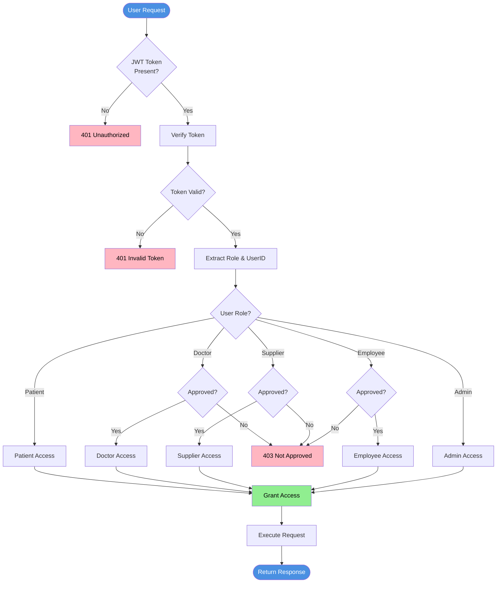

# MEDIQUICK - Mermaid Diagrams

## 1. High-Level System Architecture

```mermaid
graph TB
    subgraph Client["CLIENT LAYER"]
        direction TB
        Browser[Web Browser]
        
        subgraph ReactApp["React Application - Port 5173"]
            Router[React Router]
            Redux[Redux Store]
            Components[UI Components]
        end
        
        subgraph ClientModules["Frontend Modules"]
            PatientUI[Patient Module]
            DoctorUI[Doctor Module]
            AdminUI[Admin Module]
            EmployeeUI[Employee Module]
            SupplierUI[Supplier Module]
        end
        
        Browser --> ReactApp
        ReactApp --> ClientModules
    end
    
    subgraph Security["SECURITY LAYER"]
        CORS[CORS Policy]
        Helmet[Helmet Security]
        RateLimit[Rate Limiting]
        JWT[JWT Token Validation]
    end
    
    subgraph Server["SERVER LAYER - Port 3002"]
        direction TB
        
        subgraph APIGateway["API Gateway"]
            Express[Express.js Server]
            BodyParser[Body Parser]
            SessionMgr[Session Manager]
        end
        
        subgraph Routing["Routing Layer"]
            PatientRoutes[Patient Routes]
            DoctorRoutes[Doctor Routes]
            AdminRoutes[Admin Routes]
            EmployeeRoutes[Employee Routes]
            SupplierRoutes[Supplier Routes]
            AppointmentRoutes[Appointment Routes]
            MedicineRoutes[Medicine Routes]
            OrderRoutes[Order Routes]
            PrescriptionRoutes[Prescription Routes]
            BlogRoutes[Blog Routes]
            ReviewRoutes[Review Routes]
            ChatRoutes[Chat Routes]
        end
        
        subgraph Middleware["Middleware Layer"]
            AuthMW[Authentication MW]
            UploadMW[File Upload MW]
            ValidationMW[Validation MW]
            ErrorMW[Error Handler MW]
        end
        
        subgraph Controllers["Controller Layer"]
            PatientCtrl[Patient Controller]
            DoctorCtrl[Doctor Controller]
            AdminCtrl[Admin Controller]
            EmployeeCtrl[Employee Controller]
            SupplierCtrl[Supplier Controller]
            AppointmentCtrl[Appointment Controller]
            MedicineCtrl[Medicine Controller]
            OrderCtrl[Order Controller]
            PrescriptionCtrl[Prescription Controller]
            BlogCtrl[Blog Controller]
            ReviewCtrl[Review Controller]
            ChatCtrl[Chat Controller]
        end
        
        APIGateway --> Security
        Security --> Routing
        Routing --> Middleware
        Middleware --> Controllers
    end
    
    subgraph Data["DATA LAYER"]
        direction TB
        
        subgraph Database["MongoDB Database"]
            Collections[(Collections)]
            
            subgraph Models["Mongoose Models"]
                PatientModel[Patient Model]
                DoctorModel[Doctor Model]
                AdminModel[Admin Model]
                EmployeeModel[Employee Model]
                SupplierModel[Supplier Model]
                AppointmentModel[Appointment Model]
                PrescriptionModel[Prescription Model]
                MedicineModel[Medicine Model]
                OrderModel[Order Model]
                CartModel[Cart Model]
                BlogModel[Blog Model]
                ReviewModel[Review Model]
                ChatModel[Chat Model]
            end
        end
        
        Models --> Collections
    end
    
    subgraph External["EXTERNAL SERVICES"]
        direction TB
        EmailService[Nodemailer<br/>SMTP Email Service]
        FileSystem[File Storage System<br/>Multer]
        Logging[Morgan Logger<br/>Rotating File Stream]
    end
    
    ClientModules -->|HTTPS REST API| APIGateway
    Controllers --> Models
    Controllers --> EmailService
    Controllers --> FileSystem
    APIGateway --> Logging
    
    style Browser fill:#E8F5E9,stroke:#4CAF50,stroke-width:2px,color:#000
    style ReactApp fill:#61DAFB,stroke:#000,stroke-width:2px,color:#000
    style Express fill:#339933,stroke:#fff,stroke-width:3px,color:#fff
    style Collections fill:#47A248,stroke:#fff,stroke-width:3px,color:#fff
    style JWT fill:#FFD700,stroke:#000,stroke-width:2px,color:#000
    style EmailService fill:#EA4335,stroke:#fff,stroke-width:2px,color:#fff
    style FileSystem fill:#FF9900,stroke:#000,stroke-width:2px,color:#000
```



---

## 2. Role-Based Access Control Flow



---

## 3. Marketplace Business Flow

```mermaid
flowchart LR
    subgraph Supplier["Supplier Flow"]
        S1[Login] --> S2[Add Medicine]
        S2 --> S3[Set Price & Stock]
        S3 --> S4[Medicine Listed]
    end
    
    subgraph Patient["Patient Flow"]
        P1[Browse Medicines] --> P2[Add to Cart]
        P2 --> P3[Review Cart]
        P3 --> P4[Checkout]
        P4 --> P5[Select Address]
        P5 --> P6[Choose Payment]
        P6 --> P7[Place Order]
    end
    
    subgraph System["System Processing"]
        SYS1[Verify Stock]
        SYS2[Create Order]
        SYS3[Reduce Inventory]
        SYS4[Send Confirmation]
    end
    
    subgraph SupplierOrder["Supplier Order Management"]
        SO1[View Orders]
        SO2[Update Status]
        SO3[Mark Shipped]
        SO4[Mark Delivered]
    end
    
    S4 -.->|Available| P1
    P7 --> SYS1
    SYS1 --> SYS2
    SYS2 --> SYS3
    SYS3 --> SYS4
    SYS4 -.->|Notify| SO1
    SO1 --> SO2
    SO2 --> SO3
    SO3 --> SO4
    SO4 -.->|Complete| P1
    
    style S4 fill:#F38181,color:#fff
    style P7 fill:#FF6B6B,color:#fff
    style SYS4 fill:#4ECDC4,color:#fff
    style SO4 fill:#95E1D3,color:#000
```



---

## Copy Instructions:
1. Copy each diagram code separately (from ```mermaid to ```)
2. Paste into https://mermaid.live/
3. Diagrams will render immediately
